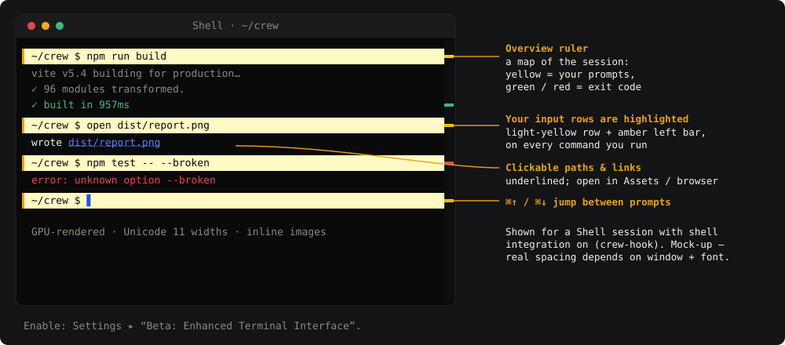
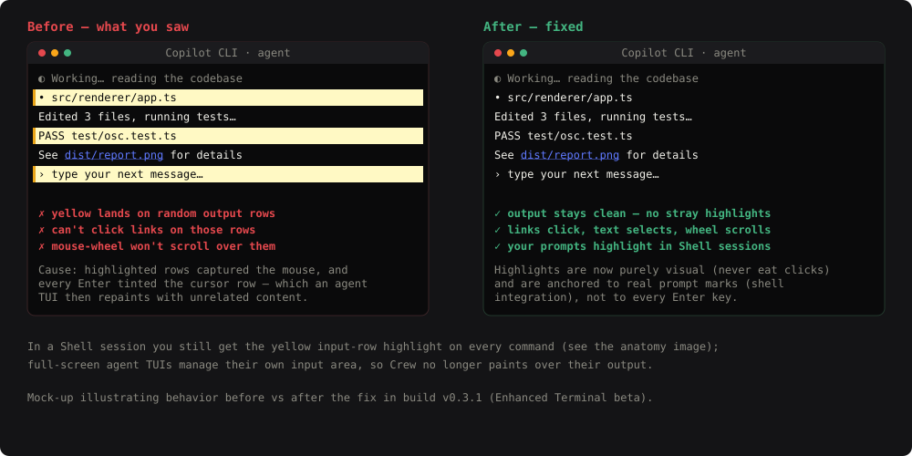

# Enhanced Terminal — Visual Guide

A picture-first tour of Crew’s **Beta Enhanced Terminal Interface**: what each
feature looks like, how to trigger it, and what “correct” looks like — so you can
tell a real problem from expected behavior.

> The screenshots below are **mock-ups** drawn with the terminal’s exact theme
> colors. They show expected appearance; real spacing depends on your window size
> and font.

## Turn it on

**Settings ▸ “Beta: Enhanced Terminal Interface.”** It’s **off by default** and
**app-wide** — every session switches to Crew’s own terminal engine. Turn it off
to instantly return to the classic terminal. Open terminals reload when you flip
it.

---

## What you’re looking at

| Feature | What to expect | How to trigger |
|---|---|---|
| **Input-row highlight** | Each command **you** run sits on a light-yellow row with a solid **amber left bar**. | Run commands in a **Shell** session. |
| **Overview ruler** | A thin map in the right gutter: **yellow** ticks = your prompts, **green/red** = last command’s exit code. | Automatic. |
| **Jump to prompt** | **⌘↑ / ⌘↓** (Ctrl on Windows/Linux) scrolls between your prompts; the key never reaches the shell. | Focus the terminal, press ⌘↑/⌘↓. |
| **Clickable paths & links** | File paths and URLs are underlined; click opens them (paths → Assets panel, URLs → browser). | Hover a path/URL in output. |
| **GPU rendering** | Crisp text, smooth fast output, correct emoji/wide-glyph widths, inline images (Sixel/iTerm2). | Automatic. |

---

## Shell sessions vs. agent sessions (important)

The input-row highlight is **accurate for Shell sessions**, where Crew installs a
tiny opt-in shell integration (`crew-hook`) that marks exactly where each prompt
and command is. You’ll see every command you type highlighted, with green/red
exit ticks in the ruler.

**Full-screen agent TUIs** (Claude Code, Copilot CLI) draw and constantly repaint
their **own** input box. Crew does **not** paint highlight rows over them — trying
to do so is exactly what produced the “random highlights” you saw. So in an agent
session you get the GPU rendering, clickable links, and inline images, but the
yellow input-row highlight is a **Shell-session** feature by design.

---

## What felt broken — and what’s fixed

You reported highlights in random places, links you couldn’t click, and broken
scrolling. That was a real bug, now fixed:

**Root cause:** highlighted rows were drawn as overlays that (1) **captured the
mouse** — so clicks, text-selection, and mouse-wheel scrolling stopped working on
any highlighted row — and (2) were placed on **every Enter**, which in a
repainting agent TUI landed them on unrelated output.

**The fix (build v0.3.1 beta):**
- Highlights are now **purely visual** — they never intercept clicks, selection,
  or scrolling.
- Highlights are **anchored to real prompt marks** (shell integration), not to
  every Enter — so they track your actual commands and never stray onto agent
  output.

---

## Feature details & how to verify

### 1. Input-row highlight
- **Expect:** in a **Shell** session, every command you run is on a light-yellow
  row with an amber left bar; the row scrolls up into history still highlighted,
  so you can scan “what did I type?” at a glance.
- **Verify:** New Session ▸ **Shell** ▸ run `echo one`, `echo two`. Each command
  line is highlighted.

### 2. Jump to prompt — ⌘↑ / ⌘↓
- **Expect:** the viewport jumps to the previous/next highlighted prompt; the
  shell does **not** receive the arrow key.
- **Verify:** after running several commands, scroll up, then press **⌘↑**/**⌘↓**.

### 3. Exit-code marks (overview ruler)
- **Expect:** a **green** tick for a command that succeeded (exit 0), **red** for
  a failure. Yellow ticks mark your prompts.
- **Verify:** run `true` then `false` in a Shell session and watch the right
  gutter.

### 4. Clickable paths & links
- **Expect:** file paths in output are underlined and open in the **Assets**
  panel; `http(s)` links open in your **browser**. Highlighted rows are clickable
  too (that was the bug).
- **Verify:** `echo see ./package.json`, then click the path.

### 5. GPU rendering, Unicode, inline images
- **Expect:** smooth rendering under heavy output; correct emoji/CJK widths;
  inline images if a tool emits Sixel or iTerm2 image sequences.
- **Verify:** `printf 'wide: 🐙 中文 |\n'` — the trailing `|` stays aligned.

---

## Troubleshooting

| You see… | Likely reason | What to do |
|---|---|---|
| No yellow highlights in an **agent** (Claude/Copilot) session | By design — agent TUIs own their input area | Use a **Shell** session to see input highlights |
| No highlights in a **Shell** session | Shell integration didn’t attach (non-zsh/bash, or a custom command) | Use the built-in **Shell** preset (zsh/bash) |
| Everything looks like the old terminal | The beta is off | Settings ▸ enable **Beta: Enhanced Terminal Interface** |
| A link won’t open | It’s not `http(s)` or a previewable file path | Only http(s) URLs and previewable files are linkified |
| Want the classic terminal back | — | Toggle the setting off; terminals reload |

---

*Images in this guide are illustrative mock-ups (`docs/superpowers/images/`),
rendered from the terminal’s real theme palette. See
[`enhanced-terminal-test-map.md`](./enhanced-terminal-test-map.md) for the full
feature list, automated tests, and the security/performance results.*
