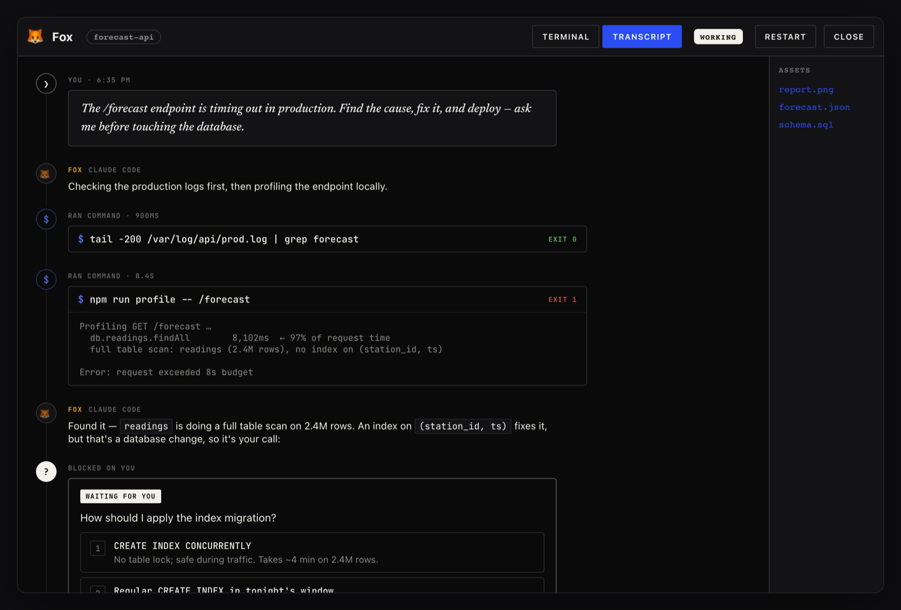
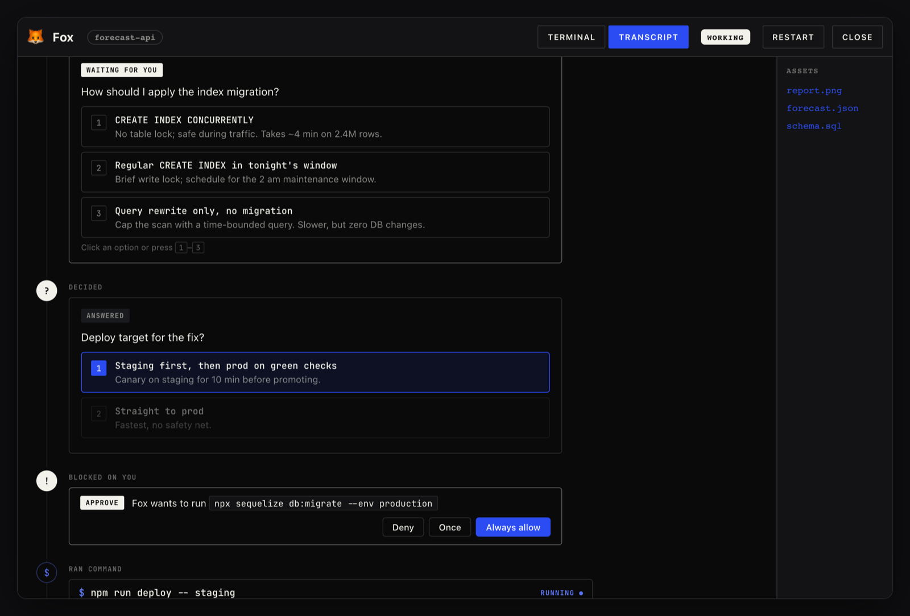
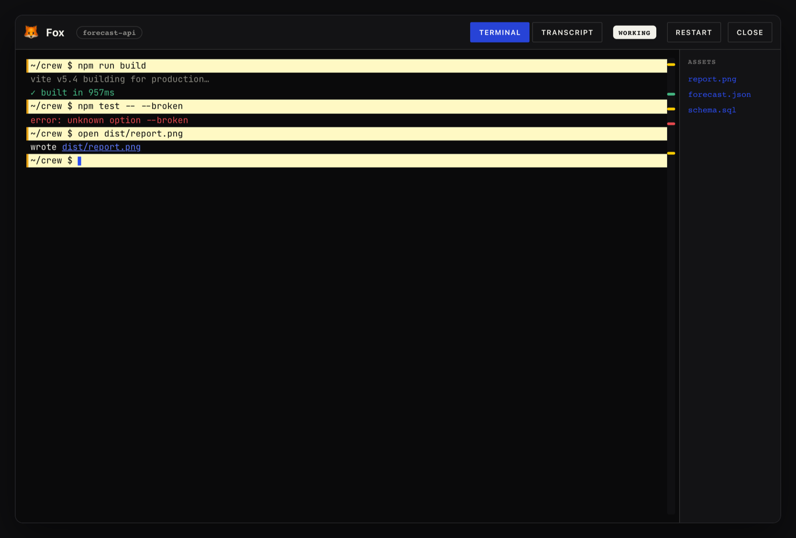

# Enhanced Terminal + Transcript — interactive mock (no build needed)

Open **[`transcript-mock.html`](./transcript-mock.html)** in any browser
(double-click it) to see this session's changes without building the app. It's a
fully self-contained file — the **real** Transcript module + Crew styles + fonts
are inlined, so it works offline from anywhere.

**What you can do in it:**

- Click the **Terminal ⇄ Transcript** toggle in the header (the real control).
- In **Transcript**: expand a *Thought for Ns* row, fold/unfold a tool run,
  click a decision option or an approve/deny button (logged to the console).
- Everything is the actual component code rendered with the shipped CSS —
  only the block data is fixtures.

## Previews

**Transcript view** — typed blocks on the hairline rail (user prompt → agent →
tool runs with exit codes → inline-code note → “blocked on you” decision):

**Decisions & approvals** — the “blocked on you” grammar (numbered choices,
resolved answer held in cobalt, permission gate):

**Terminal view** — the enhanced terminal with highlighted input rows (amber left
bar), green/red exit ticks in the overview ruler, and clickable paths:

> These are mock-ups with fixture data; real spacing depends on your window size
> and the live session stream. Regenerate after design changes with the
> throwaway harness described in the commit that added this file.
